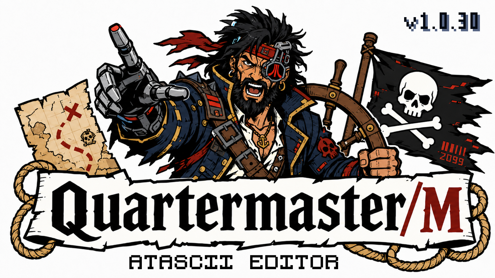
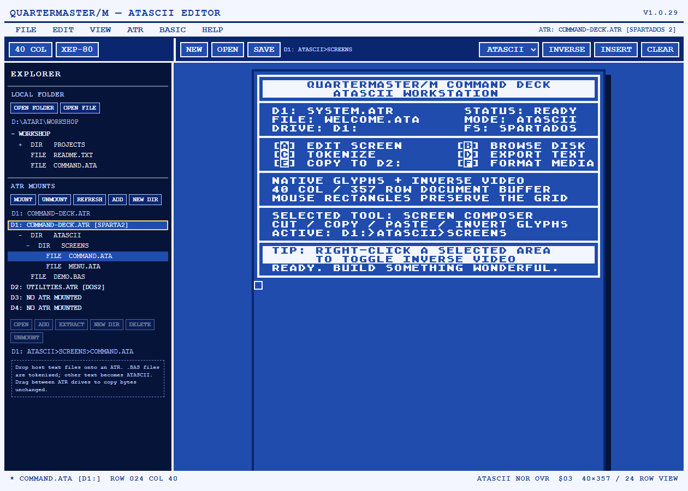
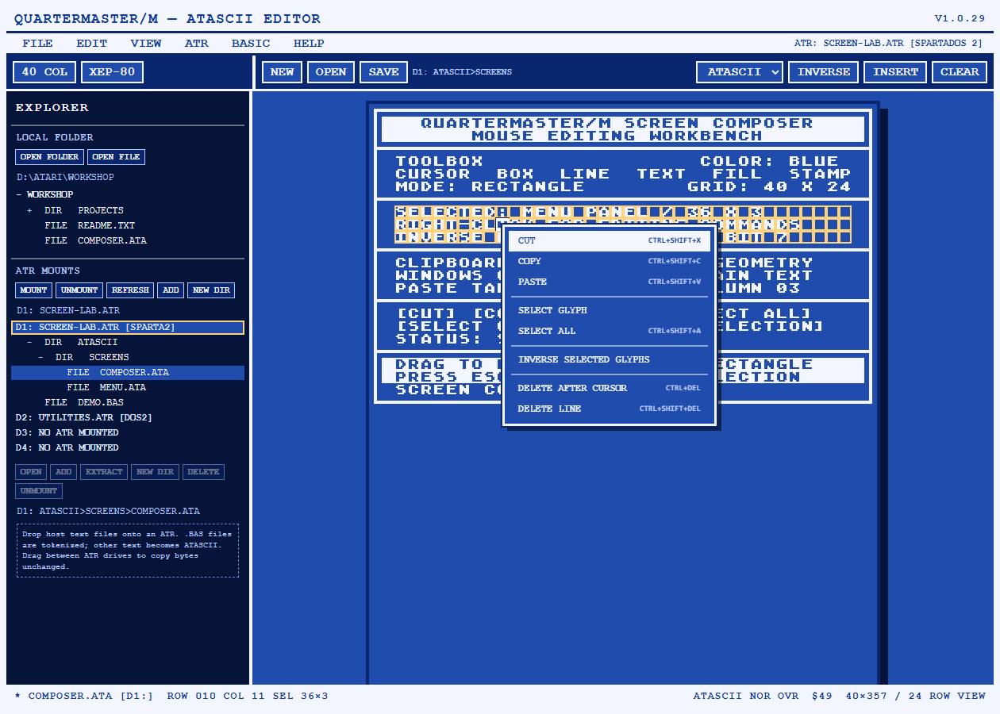

# QuarterMaster/M



**QuarterMaster/M is a desktop editor and disk-workbench for Atari 8-bit text, ATASCII screens, Atari BASIC programs, and ATR disk images.**

It combines a real 40-column Atari editing surface, an 80-column XEP-80 mode, native ATASCII rendering and conversion, four browsable ATR drive slots, SpartaDOS directories, DOS 2 images, and a native Atari BASIC tokenizer/detokenizer in one blue-and-white desktop application.

Current development version: **1.0.30**

The startup splash is generated during `npm run build` and `npm run tauri dev`: `quartermaster-splash.png` is the source artwork, and `public/quartermaster-splash.png` is the packaged image with the current `VERSION` rendered in the upper-right corner.

## See it in action

| Editing an ATASCII screen | Rectangular mouse editing |
|---|---|
| [](docs/images/quartermaster-editor.png) | [](docs/images/quartermaster-selection.png) |

## What it does

- Edits **40-column Atari** and **80-column XEP-80** documents.
- Provides **357 rows** of document space with a scrolling 24-row viewport.
- Renders the standard Atari glyph set, inverse video, and control graphics.
- Loads and saves **ATASCII** (`$9B` end-of-line) and **ASCII** (CRLF) text.
- Supports normal mouse placement, rectangular selection, Cut, Copy, Paste, Select Glyph, Select All, **Inverse Selected Glyphs**, Delete After Cursor, and Delete Line.
- Mounts up to four independent ATR images as **D1: through D4:**.
- Browses mounted ATR files and directories directly in Explorer.
- Opens ATR files by double-click or right-click → Open.
- Creates DOS 2 and SpartaDOS ATRs at **90K, 130K, 180K, 360K, 16M**, or custom geometry.
- Imports host text as ATASCII, tokenizes dropped `.BAS` listings, and preserves native bytes during ATR-to-ATR copies.
- Exports ATR content as readable Windows text or extracts exact raw bytes.
- Tokenizes and detokenizes Atari BASIC natively in Rust—no console utility or external converter is required.
- Shows an immediate splash screen and animated activity feedback for longer operations.
- Checks the published release manifest from **Help → Check for Updates**, with Windows portable EXE/MSI updates and a macOS universal DMG update.
- Starts as a Windows GUI application without opening a command window.

## Quick start

1. Run `quartermaster-m.exe`.
2. Click **Open Folder** for host files, or choose **ATR → Open/Mount** to mount a disk image in D1:–D4:.
3. Click a Local/ATR directory to make it active. The active location has a gold outline and appears above the editor.
4. Double-click a file, right-click it and choose **Open**, or use the toolbar **Open** button.
5. Edit with the keyboard and mouse. Drag to select a rectangular area; right-click the selection for editing actions.
6. Press **Ctrl+Shift+S**. Save defaults to the active local folder or the ATR directory from which the file was opened.

The **Help** menu contains the complete in-app manual, keyboard/mouse reference, searchable 256-byte ATASCII map, update checker, license, About dialog, and support link.

## Windows SmartScreen notice

Windows may display **“Windows protected your PC”** when QuarterMaster/M is downloaded and started. This can happen when an application is unsigned or when a newly signed release has not yet accumulated enough Microsoft Defender SmartScreen reputation.

Only continue when you downloaded QuarterMaster/M from the official project or another source you trust. To continue past the warning:

1. Select **More info**.
2. Confirm that the application is `quartermaster-m.exe` and review any displayed publisher information.
3. Select **Run anyway**.

Do not bypass SmartScreen when the file came from an unknown source or its identity is unexpected. A valid code signature provides publisher and integrity information, but Microsoft notes that a new signed binary may still show the warning until its file or publisher reputation develops. See [Microsoft’s SmartScreen guidance for Windows applications](https://learn.microsoft.com/en-us/windows/apps/package-and-deploy/smartscreen-reputation).

## Important concepts

### Active location

The highlighted Explorer location controls **New, Open, and Save**. A selected file targets its parent folder. Local locations use native Windows dialogs; ATR locations use an in-app Atari filename dialog.

### ATASCII versus ASCII

| Mode | Line ending | Inverse video | Intended destination |
|---|---:|---|---|
| ATASCII | `$9B` | Preserved in bit 7 | Atari programs, emulators, ATR images |
| ASCII | CRLF | Removed | Windows editors, source control, sharing |

### Export versus raw extraction

- **Export ASCII** translates ATASCII into readable Windows text and detokenizes Atari BASIC when possible.
- **Extract Raw** copies the file's bytes unchanged.
- **ATR-to-ATR drag** also preserves bytes unchanged.

## Documentation

The documentation is intentionally detailed. Start with the [documentation index](docs/README.md), or go directly to:

- [Complete user guide](docs/USER_GUIDE.md)
- [ATASCII reference and all mappings](docs/ATASCII_REFERENCE.md)
- [Keyboard and mouse reference](docs/KEYBOARD_AND_MOUSE.md)
- [ATR and disk-image guide](docs/ATR_GUIDE.md)
- [Atari BASIC guide](docs/BASIC_GUIDE.md)
- [File formats and conversion behavior](docs/FILE_FORMATS.md)
- [Troubleshooting and support](docs/TROUBLESHOOTING.md)
- [Building and release packaging](docs/BUILDING_AND_RELEASES.md)
- [Architecture and source layout](docs/ARCHITECTURE.md)
- [Contributing](docs/CONTRIBUTING.md)

The canonical machine-readable ATASCII tables and historical reference material are retained under [`atascii_kit/`](atascii_kit/).

## Development

Requirements:

- Windows 10 or 11
- Node.js with npm
- Stable Rust toolchain with Cargo
- Tauri 2 Windows prerequisites (MSVC Build Tools and WebView2)

Install and run with hot reload:

```powershell
npm install
npm run tauri dev
```

Build only the runnable development executable, with installer bundling disabled:

```powershell
npm run tauri -- build --no-bundle
Copy-Item src-tauri\target\release\quartermaster-m.exe packages\win64\quartermaster-m.exe -Force
```

The result can be launched directly as:

```text
packages\win64\quartermaster-m.exe
```

Production MSI/NSIS creation and its WebView2 payload audit are documented separately in [Building and Releases](docs/BUILDING_AND_RELEASES.md). Development work does not need to run that release workflow.

## Support

For a bug report, documentation correction, or feature request, open an issue:

**https://github.com/rickcollette/quartermaster-m/issues**

Please include the QuarterMaster/M version, Windows version, exact steps, expected and actual results, full error text, relevant document mode/geometry/filesystem, and a minimal sample or redacted screenshot when possible.

## License

QuarterMaster/M is licensed under **GPL-2.0-or-later**. See [LICENSE](LICENSE).
